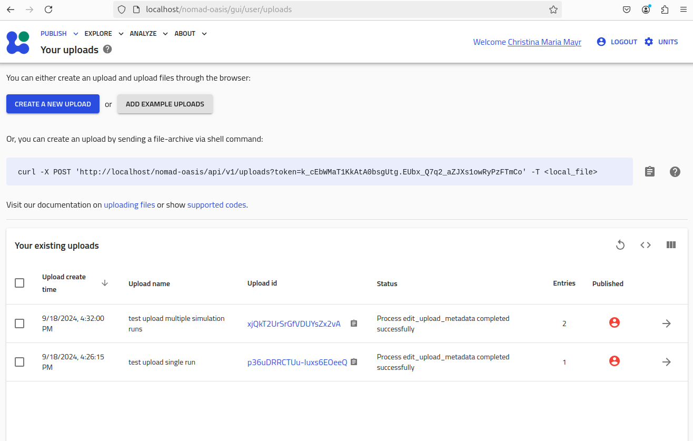
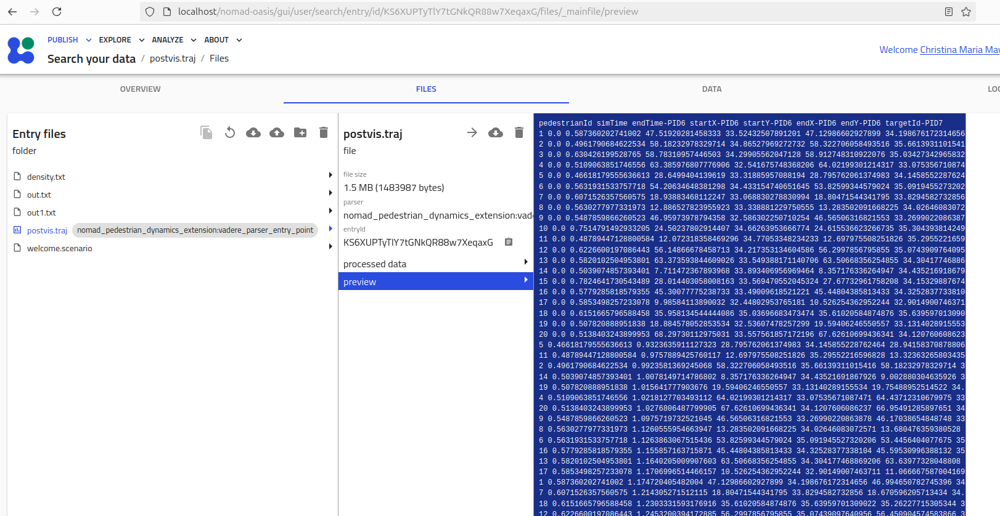
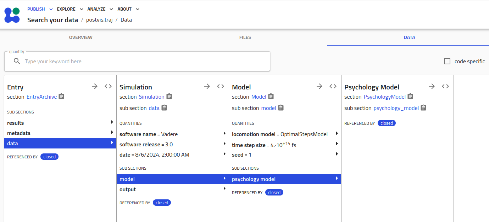

# NOMAD's pedestrian dynamics extension 

This is a collection of the NOMAD parsers for the following codes:
- [Vadere](https://www.vadere.org)

If you are not familiar with schema plug-ins (normalizer plug-ins) and parser plug-ins, please read our [overview of NOMAD concepts](docs/concepts/plugin_types_and_data_processing.md).


## Testing plug-ings locally (this does not require a running NOMAD Oasis)

Simply run the *.py tests in [tests directory](tests).
Please also see the [documentation](docs/index.md).


## Running the plug-ins in a NOMAD oasis

Please follow the instructions from: https://nomad-lab.eu/prod/v1/docs/howto/oasis/plugins_install.html

> [!WARNING]
> The setup instructions seems to be constantly changing.

I used the option with the derived Docker image.
Setup an oasis without plug-ins (detailed information can be found in the [documentation-1](https://nomad-lab.eu/prod/v1/docs/howto/oasis/install.html)):

Download the [nomad-oasis.zip](https://nomad-lab.eu/prod/v1/docs/assets/nomad-oasis.zip)
```
unzip nomad-oasis.zip
cd nomad-oasis
sudo chown -R 1000 .volumes
docker compose pull
```

Create the derived Docker image. Copy the following content into an empty Dockerfile (textfile named "Dockerfile") 

```
FROM gitlab-registry.mpcdf.mpg.de/nomad-lab/nomad-fair:latest

# Switch to root user to install packages to the system with pip
USER root

# for installing a python repo from github
RUN apt-get update && apt-get -y install git

RUN pip install --upgrade pip

# installs nomad version 1.3.6 - which is required by the nomad-schema-plugin-run depencency. 
# Automatic dependency resolving is not working! 
# REPLACE the following line as soon as a stable nomad version is available
RUN pip install https://gitlab.mpcdf.mpg.de/api/v4/projects/2187/packages/pypi/files/472e0cb3bc16d51251a84464686db9e1ce80791a945ffa5faa3e69ee869b6012/nomad-lab-1.3.6.dev41+g0347838e4.tar.gz

# Install your plugin here, e.g.:
RUN pip install git+https://github.com/pedestrian-dynamics-HM/nomad-pedestrian-dynamics-extension.git@manage_deps

# Remember to switch back to the 'nomad' user
USER nomad
```

Replace the Docker image "gitlab-registry.mpcdf.mpg.de/nomad-lab/nomad-fair:latest" by the derived image in nomad-oasis/docker-compose.yaml:

```
  worker:
    restart: unless-stopped
    #image: gitlab-registry.mpcdf.mpg.de/nomad-lab/nomad-fair:latest
    image: nomad-with-plugins

  north:
    restart: unless-stopped
    #image: gitlab-registry.mpcdf.mpg.de/nomad-lab/nomad-fair:latest
    image: nomad-with-plugins

  app:
    restart: unless-stopped
    #image: gitlab-registry.mpcdf.mpg.de/nomad-lab/nomad-fair:latest
    image: nomad-with-plugins
```

Start the oasis
```
docker compose up -d
```
Open http://localhost/nomad-oasis in your browser.

### Uploading entries

One can upload a single simulation run or a collection of simulation runs. 
This repository contains *.zip-files for testing both functionalities:

- [archive of a single simulation run](tests/data/basic_2_density_discrete_ca_2024-08-05_12-33-49.69.zip)
- [archive with multiple simulation runs](tests/data/several_scenario_runs.zip)

The following snapshot was taken after uploading the two archives to an empty oasis:




### WIP: Vadere plug-in structure

For each data entry the raw files are available. The mainfile is Vadere's trajectory file:




Meta information is automatically extracted from the *.scenario file. The structure of the sections is still WIP.




