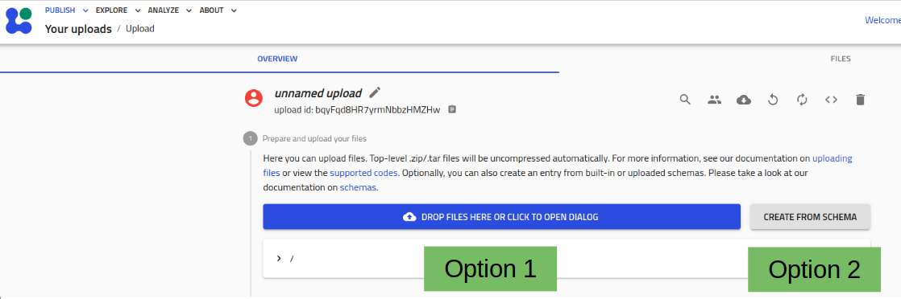
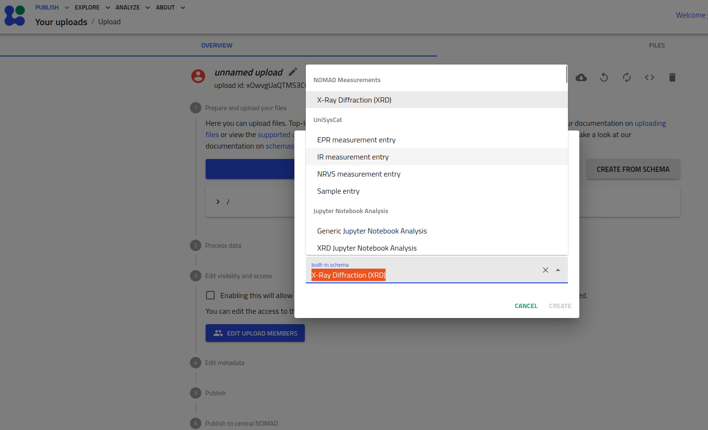
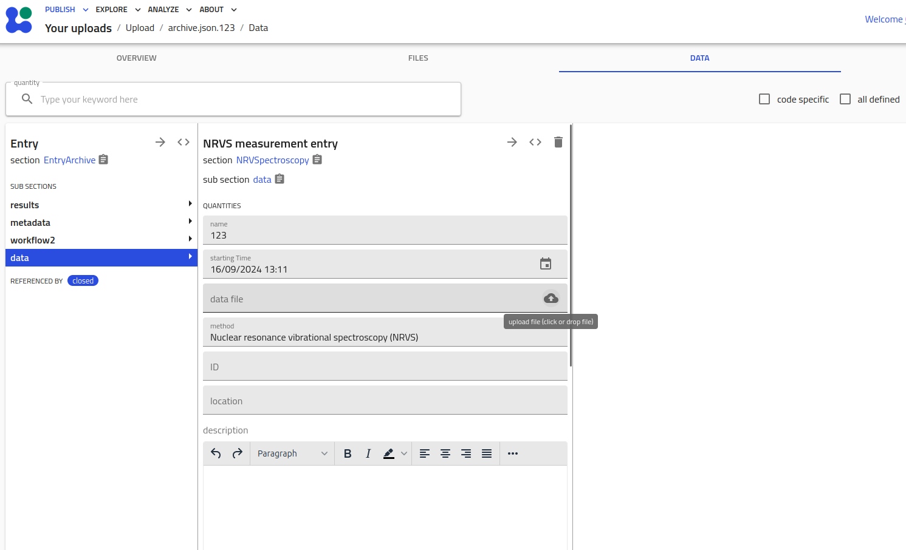
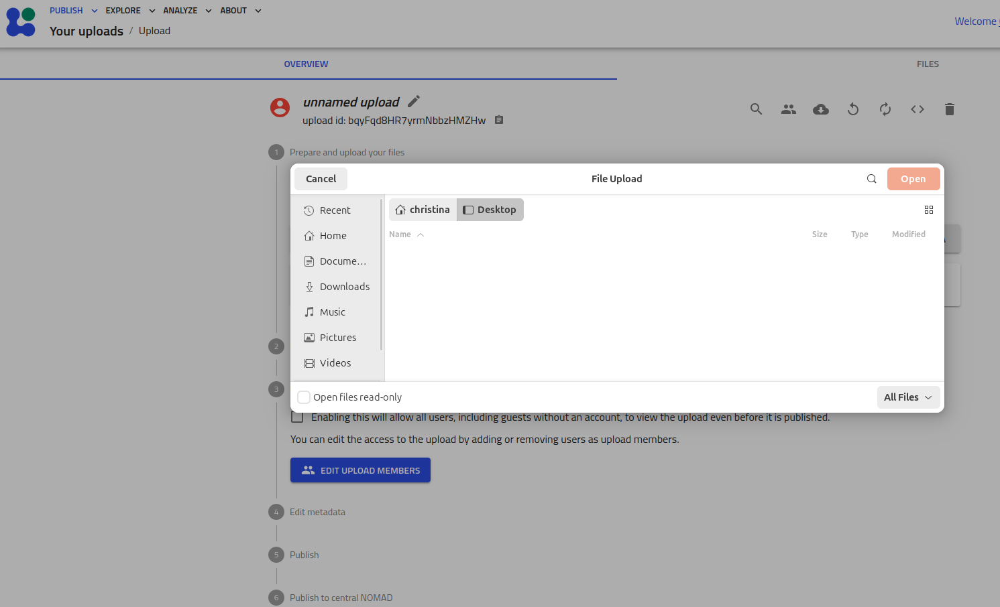

# Parser plug-ins vs. schema plug-ins
This information is based on the FAIRmat Tutorial 12 (https://www.youtube.com/watch?v=mc5kZjeF7KU).

## Distinction
There are two types of plug-ins to process data. Which type of plug-in is triggered depends on the user's choice of the upload method:

- The parser plug-in is triggered when the user picks option 1.
- The schema plug-in (also called normalizer plug-in) is triggered when the user picks option 2.

If the user uploads an archive with raw data (option 1), a suitable parser is automatically assigned depending on the raw data structure (“matching”). The result data is automatically processed from the raw data (“parsing”). 
The result data is again processed to extract meta data (“normalizing”). Users typically choose this option when they only have raw data from an experiment or simulation which needs to be formatted first before one can derive results.

If the user chooses the schema option (option 2), an empty data entry is generated in which the user puts meta data manually. Raw data is not formatted. The user has to upload the formatted result data. 
The result data can be processed automatically to extract meta data (“normalizing”).

## Choice of plug-in type

Which type of plug-in should be used, depends on the use case. If the data from the experiment or simulation is already in the final format, the schema plug-in may be favored (the parser plug-in created an overhead). If the data needs to be formated, the parser plug-in is required. 

| Option           | Raw data                         | Result data                                                               | Meta data                                                                                                             |
|------------------|----------------------------------|---------------------------------------------------------------------------|-----------------------------------------------------------------------------------------------------------------------|
| 1 Parser plug-in | needs to be provided by the user | is generated automatically from the raw data (requires a parser() method) | is extracted automatically from the processed data  (requires a normalizer() method)                                  |
| 2 Schema plug-in | -                                | needs to be provided by the user                                        | is provided by the USER   AND/OR  is extracted automatically from the processed data (requires a normalizer() method) |

## Comments on triggering plug-ins

### Triggering the schema plug-in

The user selects a schema over the web-interface. The user fill the input mask with data and meta-data. If the schema contains a normalizer meta-data is automatically generated from the user input when saving the  user input.
Schemas are available as "built-in schema" on the web-interface. Here is an example schema ("XRay Diffraction"):

The experimental data is added directly in the data entry. When clicking "save" the data is further processed if there is a normalizer attached to the schema:

### Triggering the parser plug-in

The user provides a data archive. Then everything is processed automatically.

Some images are snapshots from FAIRmat Tutorial 12 (https://www.youtube.com/watch?v=mc5kZjeF7KU)
