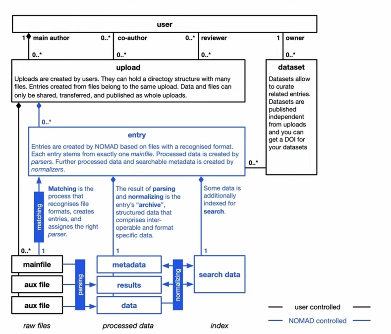

# General NOMAD concepts 
This information is based on the FAIRmat Tutorial 12 (https://www.youtube.com/watch?v=mc5kZjeF7KU).

## Schemas
Schemas define the structure of data:

Schemas can be specified as *.yaml file OR as Python class. We use Python classes.
In Python a schema is defined by implementing the MSection interface:

NOMAD provides interfaces for schemas for empirical data and simulation data.

We implement these interfaces for pedestrian dynamics specific applications:
- empirical research: laboratory experiments, field observations
- simulation studies: conducted with the Optimal Steps Model, conducted with the Social Force Model, ... 

## Data processing 

There are different types of plug-ins that process data:
- Parsers: parse raw data. 
- Normalizers: parse processed data. 

The normalizing process is executed after the parsing process: 

All images are snapshot from FAIRmat Tutorial 12 (https://www.youtube.com/watch?v=mc5kZjeF7KU)
