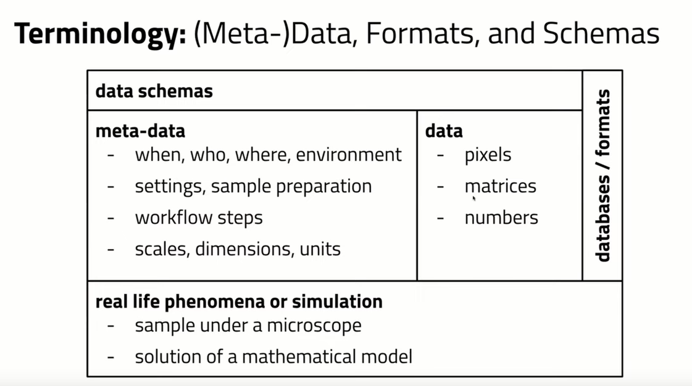
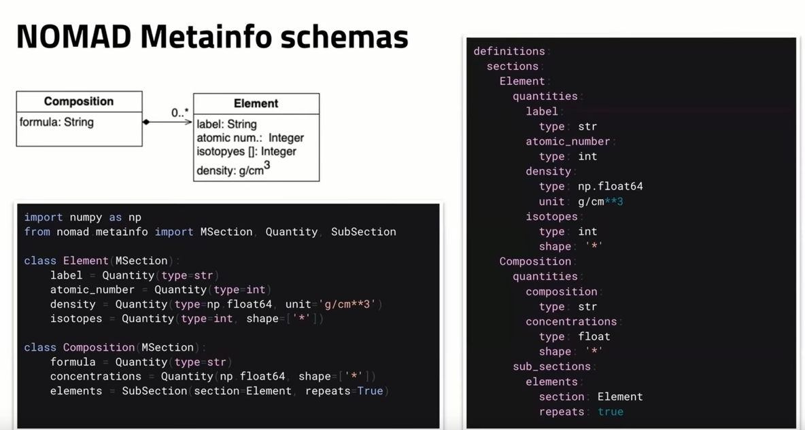
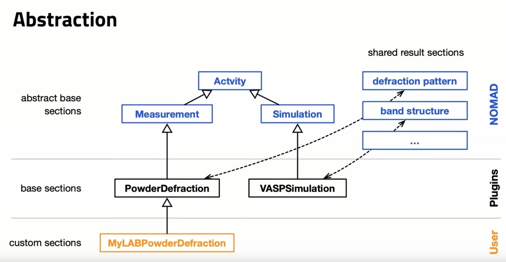
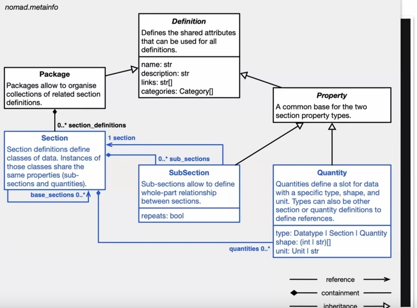

## Schemas
Schemas define the structure of data:

### How to define schemas

Schemas can be specified as *.yaml file OR as Python class. We use Python classes.
In Python a schema is defined by implementing the MSection interface:

NOMAD provides interfaces for schemas for empirical data and simulation data.

Some images are snapshots from FAIRmat Tutorial 12 (https://www.youtube.com/watch?v=mc5kZjeF7KU)
